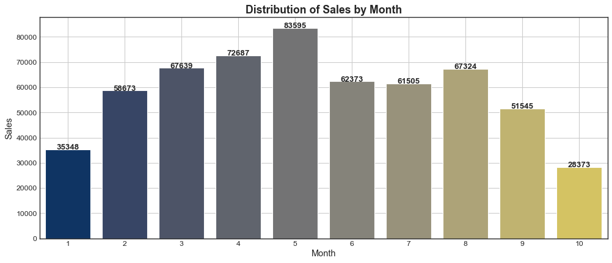
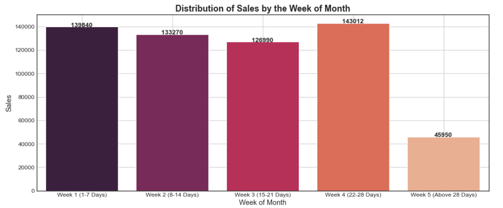
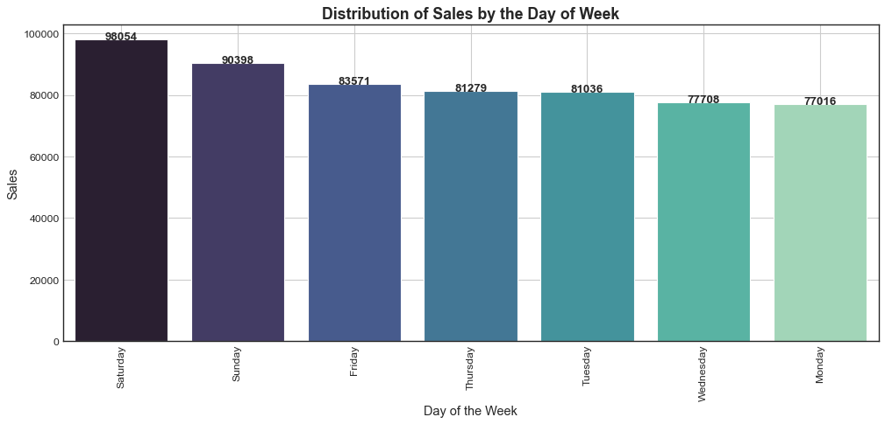
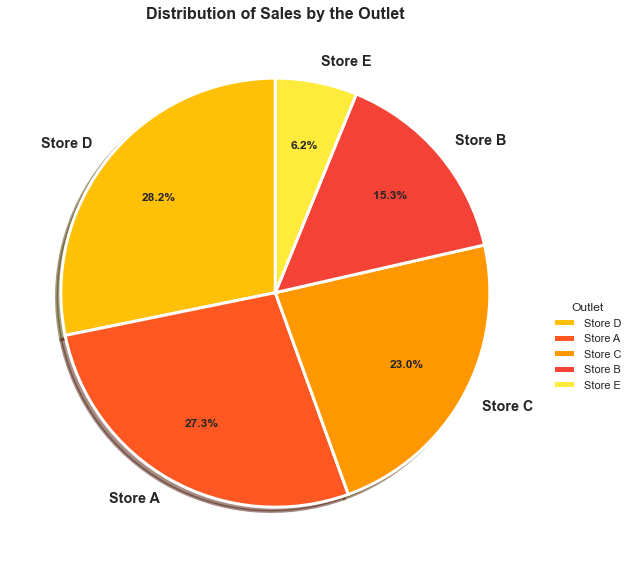
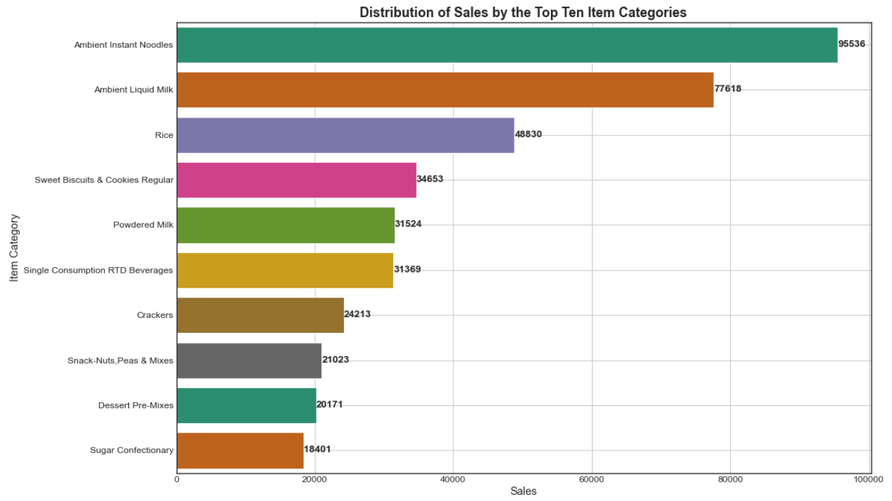
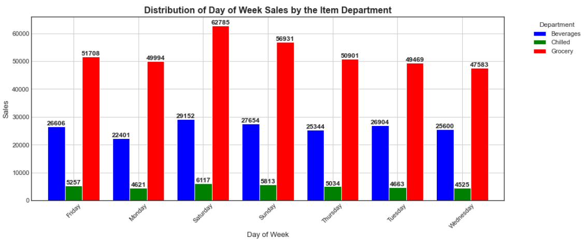
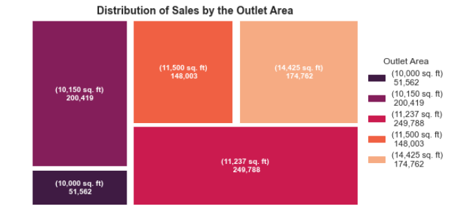
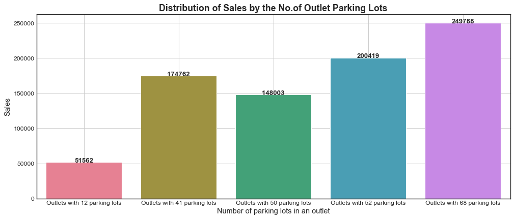
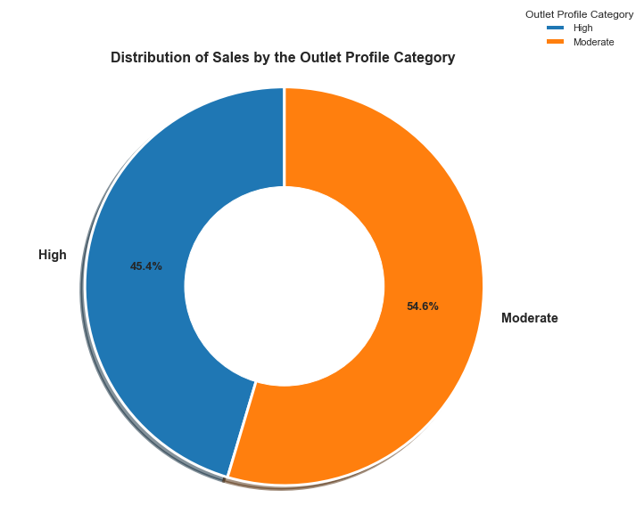

# Supermarket Sales Forecasting — Next-Week Demand Prediction

## Executive Summary

This project builds a machine learning pipeline to forecast next-week sales for the top 5 fast-moving item categories across three departments — **Grocery, Beverages, and Chilled** — in five supermarket outlets (**A, B, C, D, E**). The workflow moves from descriptive analysis and hypothesis testing on historical transactions, through a modular feature engineering and modelling pipeline, to forecast accuracy assessed at outlet, department, and category level using **MAPE**. The goal is to support inventory optimization, replenishment planning, and supply chain efficiency.

## Project Objectives

- Validate assumptions about sales behaviour using descriptive statistics and hypothesis testing
- Identify the top 5 fast-moving categories per department and outlet
- Design a modular, config-driven pipeline for feature and master table generation
- Build a next-week sales forecasting model following model management best practices
- Assess forecast accuracy (MAPE) at Outlet–Department–Week and Outlet–Category–Week granularity
- Document the approach in a technical report covering methodology, implementation, and findings

## Overview of the Data

The dataset is made up of three sources:

- **item_info.csv** — item code, item category, sub-department, and department
- **outlet_info.csv** — outlet code, outlet area (sq. ft.), number of parking lots, outlet profile category (customer type), and outlet cluster category (layout type)
- **transactions_info.csv** — outlet code, item code, transaction date, and sales quantity

These are joined on **outlet_code** and **item_code**, with the analysis and modelling keyed on **Outlet | Item Category | Week**.

## Exploratory Data Analysis

Descriptive analysis was carried out across time, outlet, and item dimensions to understand sales behaviour before feature and hypothesis design.

- **Sales by month:** an upward trend from Month 1 to Month 5, a sharp dip in Month 6–7, and a further decline in Month 9–10 — indicating a mixed rather than purely seasonal pattern.

- **Sales by week of month:** Week 4 recorded the highest sales (143,012 units), consistent with a salary-cycle effect, while Week 1–3 declined gradually (139,840 → 126,990 units); Week 5 (the partial week beyond day 28) added 45,950 units.

- **Sales by day of week:** weekends were strongest — Saturday (98,054 units) and Sunday (90,398 units) — with Monday lowest (77,016 units).

- **Sales by outlet:** Outlet D (28.2%) and Outlet A (27.3%) led total sales share, followed by Outlet C (23%), with Outlet E lowest (6.2%).

- **Top item categories:** Ambient Instant Noodles and Ambient Liquid Milk led sales, with Rice also prominent as a staple category.

- **Department × day-of-week:** Grocery was the most consistently popular department, peaking on Sunday, Saturday, and Friday; Chilled peaked on weekends; Beverages showed more variation through the week.

- **Outlet area and parking lots:** sales were mapped against outlet area and number of parking lots to explore facility-driven demand differences.

- **Outlet profile category:** outlets with a "Moderate" customer profile (450,207 units) outsold those with a "High" profile (374,327 units).

## Hypothesis Testing

Five hypotheses were tested to validate the drivers behind the EDA patterns above, using significance testing at the 0.05 level.

| # | Hypothesis | Result |
|---|---|---|
| 1 | Combined Week 4 + Week 5 sales are higher than other individual weeks (salary cycle effect) | **Rejected H0** — supported |
| 2 | Weekend sales are higher than weekday sales | **Rejected H0** — supported |
| 3 | Larger outlet area leads to higher sales (r = 0.245, p = 0.691) | **Failed to reject H0** — not supported |
| 4 | More outlet parking lots leads to higher sales (r = 0.956, p = 0.011) | **Rejected H0** — supported |
| 5 | "High" profile outlets outsell "Moderate" profile outlets | **Failed to reject H0** — not supported |

**Key takeaway:** time-based effects (salary-cycle weeks and weekends) and outlet parking-lot capacity are meaningful, statistically-supported drivers of sales, while outlet area and customer profile category alone are not. This informed which outlet and time-related features were prioritised in the pipeline.

## Pipeline Design

The workflow is modularized under the `src/` directory, following the project's stipulated folder structure (`analysis/`, `src/utils`, `src/models`, `pipelines/<module_name>`, `conf/`):

- **Data Processing:** ingest and clean the item, outlet, and transaction sources into model-ready inputs.
- **Primary Keys:** Outlet | Item Category | Week.
- **Target Variable:** next week's sales quantity per key.
- **Feature Construction:**
  - *Sales-related* — historical sales, trend, and lag features
  - *Item-related* — category and department attributes
  - *Time-related* — week-of-month, day-of-week, and salary-cycle indicators (informed by Hypotheses 1 & 2)
  - *Outlet-related* — area, parking lots, profile, and cluster category (informed by Hypotheses 3–5)
- **Master Table Pipeline:** combines all engineered features into a single modelling table.
- **Model Fitting Pipeline:** trains and evaluates the forecasting model separately from feature generation.
- **Configuration:** a central `conf/` module (`get_conf()`) drives paths and parameters across pipelines.

## Model Development

- **Target:** next-week sales quantity for the top 5 fast-moving categories per department and outlet.
- **Evaluation Metric:** Mean Absolute Percentage Error (MAPE), assessed at two granularities:
  - Outlet | Item Department | Week
  - Outlet | Item Category | Week
- **Best Practices:** PEP-8 compliant, modularized code, externalized configuration, and reusable functions/classes rather than notebook-only logic.

## Key Outcomes

- Delivers next-week sales forecasts for the top 5 fast-moving categories per department and outlet.
- Grounds feature selection in statistically validated drivers rather than assumptions.
- Supports better inventory planning, stock optimization, and supply chain decisions.
- Modular pipeline design allows easy extension to additional stores, departments, or categories.

## Risks and Assumptions

- Descriptive patterns (e.g. salary-cycle weeks, weekend peaks) are assumed to persist going forward.
- Outlet area and profile category were found not to be significant sales drivers and were deprioritized accordingly.
- Forecast accuracy is bounded by the granularity and completeness of the transactional history available.

## Tech Stack

- **Programming:** Python
- **Libraries:** pandas, numpy, scikit-learn, matplotlib, seaborn, scipy (hypothesis testing)
- **Architecture:** Modular ML pipeline (`src/`, `pipelines/`, `conf/`, `analysis/`)
- **Evaluation Metrics:** Mean Absolute Percentage Error (MAPE)

## Scalability & Future Improvements

- Incorporate promotion and pricing data
- Integrate external factors such as weather effects
- Benchmark advanced models (XGBoost, LightGBM) against the baseline
- Implement hierarchical forecasting across outlet/department/category levels
- Deploy via API for real-time inference
- Add an automated retraining workflow

